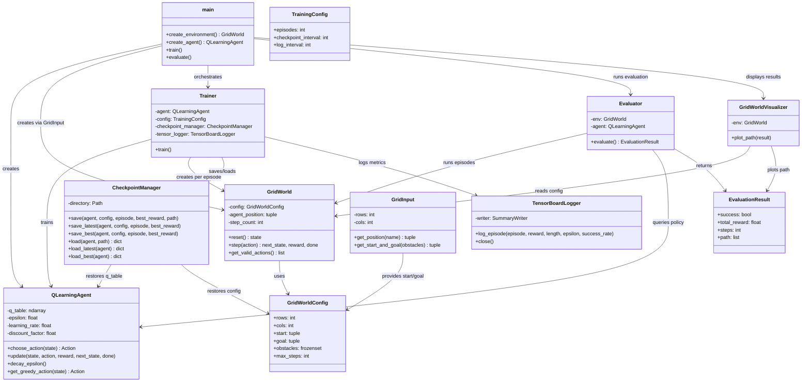

# Project 01: Q-Learning Grid World

## Table of Contents

1. [Project Overview](#project-overview)
2. [What is Q-Learning?](#what-is-q-learning)
3. [Project Architecture](#project-architecture)
4. [Class Connection Graph](#class-connection-graph)
5. [Environment: Grid World](#environment-grid-world)
5. [Agent: Q-Learning Implementation](#agent-q-learning-implementation)
6. [Training Pipeline](#training-pipeline)
7. [Evaluation](#evaluation)
8. [Visualization](#visualization)
9. [File Structure](#file-structure)
10. [How to Run](#how-to-run)
11. [Hyperparameters](#hyperparameters)
12. [Reward System](#reward-system)
13. [Testing](#testing)

---

## Project Overview

This project implements **Q-Learning**, a foundational model-free reinforcement learning algorithm, on a custom **Grid World** environment. The agent learns to navigate a 5×5 grid from a start position to a goal position while avoiding obstacles.

The project is structured as a modular Python application with clear separation of concerns:
- **Environment**: Defines the grid world dynamics, actions, and rewards
- **Agent**: Implements the Q-Learning algorithm with epsilon-greedy exploration
- **Training**: Orchestrates the learning loop with checkpointing and logging
- **Evaluation**: Tests the learned policy without exploration
- **Visualization**: Plots the agent's learned path on the grid

---

## Class Connection Graph

The following diagram shows how the main classes and modules interact during training and evaluation:



### Data Flow During Training

```
main.py
  │
  ├── create_agent() ──────────► QLearningAgent
  │     (rows, cols, lr, gamma, epsilon, ...)
  │
  ├── create_environment() ────► GridInput ──► GridWorldConfig
  │     (get start/goal from user)      │
  │                                     ▼
  ├── Trainer ────────────────────────► GridWorld
  │     │                                    │
  │     ├── episode loop                    │
  │     │     ├── reset() ──────────────► state
  │     │     ├── choose_action() ◄────── QLearningAgent
  │     │     ├── step() ◄─────────────── GridWorld
  │     │     │     (next_state, reward, done)
  │     │     ├── update() ─────────────► QLearningAgent
  │     │     └── decay_epsilon() ◄────── QLearningAgent
  │     │
  │     ├── CheckpointManager
  │     │     ├── save_best() ───► best.npz
  │     │     └── save_latest() ─► latest.npz
  │     │
  │     └── TensorBoardLogger
  │           └── log_episode() ──► runs/q_learning/
  │
  └── evaluate()
        ├── CheckpointManager.load_latest() ◄── latest.npz
        ├── Evaluator
        │     ├── reset() ──────────────► GridWorld
        │     ├── get_greedy_action() ◄── QLearningAgent (ε=0)
        │     └── step() ◄─────────────── GridWorld
        └── GridWorldVisualizer.plot_path() ──► matplotlib
```

---

## What is Q-Learning?

Q-Learning is an **off-policy** temporal difference learning algorithm that learns the optimal action-value function `Q*(s, a)` without requiring a model of the environment.

### Core Concept

The agent maintains a **Q-table** where each entry `Q(s, a)` represents the expected cumulative discounted reward of taking action `a` in state `s` and then following the optimal policy.

### The Q-Learning Update Rule

```
Q(s, a) ← Q(s, a) + α * [r + γ * max(Q(s', a')) - Q(s, a)]
```

Where:
- `α` (alpha) = **learning rate**: How much new information overrides old information
- `γ` (gamma) = **discount factor**: How much future rewards are valued
- `r` = immediate reward received after taking action `a` in state `s`
- `s'` = next state after taking action `a`
- `max(Q(s', a'))` = maximum expected future reward from next state

### Exploration vs Exploitation

The agent uses an **epsilon-greedy** strategy:
- With probability `ε`: explore (take random action)
- With probability `1-ε`: exploit (take best known action)

Epsilon decays over time, shifting from exploration to exploitation.

---

## Project Architecture

```
project_01_q_learning/
├── main.py                    # Entry point with CLI
├── agent/
│   ├── __init__.py
│   └── q_learning.py          # Q-Learning agent implementation
├── environment/
│   ├── __init__.py
│   ├── config.py              # Grid world configuration
│   └── grid_world.py          # Grid world environment
├── training/
│   ├── __init__.py
│   ├── checkpoint.py          # Save/load Q-tables
│   ├── config.py              # Training hyperparameters
│   ├── tensorboard_logger.py  # TensorBoard logging
│   └── train.py               # Training loop
├── evaluation/
│   ├── __init__.py
│   └── evaluate.py            # Policy evaluation
├── visualization/
│   ├── __init__.py
│   └── visualize.py           # Matplotlib plotting
├── input/
│   ├── __init__.py
│   └── grid_input.py          # User input handling
├── utils/
│   ├── __init__.py
│   └── logger.py              # Logging configuration
├── tests/                     # Unit tests
├── checkpoints/               # Saved Q-tables
├── runs/                      # TensorBoard logs
└── logs/                      # Application logs
```

---

## Environment: Grid World

### Grid World Config

Defined in [`environment/config.py`](environment/config.py):

```python
@dataclass(frozen=True)
class GridWorldConfig:
    rows: int              # Number of rows in the grid
    cols: int              # Number of columns in the grid
    start: tuple[int, int] # Starting position (row, col)
    goal: tuple[int, int]  # Goal position (row, col)
    obstacles: frozenset[tuple[int, int]]  # Obstacle positions
    max_steps: int = 100   # Maximum steps per episode
```

### Actions

Defined in [`environment/grid_world.py`](environment/grid_world.py) as an `IntEnum`:

| Action | Value | Description |
|--------|-------|-------------|
| `UP` | 0 | Move up (row - 1) |
| `DOWN` | 1 | Move down (row + 1) |
| `LEFT` | 2 | Move left (col - 1) |
| `RIGHT` | 3 | Move right (col + 1) |

### State Representation

The state is a **4-tuple**: `(row, col, goal_row, goal_col)`

This is a key design choice — the agent's current position AND the goal position are both part of the state. This means the Q-table must account for all possible start-goal combinations, making the Q-table 5-dimensional: `(rows, cols, rows, cols, num_actions)`.

### Environment Dynamics

The [`GridWorld`](environment/grid_world.py) class implements a standard RL environment interface:

- **`reset()`**: Resets the agent to the start position, returns initial state
- **`step(action)`**: Takes an action, returns `(next_state, reward, done)`

### Movement Rules

1. **Valid movement**: Agent moves to the adjacent cell, receives `-0.1` reward
2. **Wall collision**: Agent stays in place, receives `-1.0` reward
3. **Obstacle collision**: Agent stays in place, receives `-1.0` reward
4. **Goal reached**: Episode ends, agent receives `+10.0` reward
5. **Max steps exceeded**: Episode ends with no additional reward

---

## Agent: Q-Learning Implementation

### Q-Learning Agent

Defined in [`agent/q_learning.py`](agent/q_learning.py):

```python
class QLearningAgent:
    def __init__(
        self,
        rows: int,
        cols: int,
        learning_rate: float = 0.1,
        discount_factor: float = 0.99,
        epsilon: float = 1.0,
        epsilon_decay: float = 0.995,
        epsilon_min: float = 0.01,
    ):
```

### Q-Table

The Q-table is a 5D NumPy array:

```python
self.q_table = np.zeros(
    (rows, cols, rows, cols, num_actions),
    dtype=np.float32,
)
```

Dimensions: `[current_row, current_col, goal_row, goal_col, action]`

### Key Methods

#### `choose_action(state, training=True)`

Selects an action using epsilon-greedy policy:

```python
def choose_action(self, state, training=True):
    if training and np.random.random() < self.epsilon:
        return Action(np.random.randint(self.num_actions))  # Explore
    
    # Exploit: choose action with highest Q-value
    q_values = self.q_table[row, col, goal_row, goal_col]
    return Action(int(np.argmax(q_values)))
```

#### `update(state, action, reward, next_state, done)`

Applies the Q-Learning update rule:

```python
def update(self, state, action, reward, next_state, done):
    current_q = self.q_table[row, col, goal_row, goal_col, action]
    
    if done:
        target = reward  # No future rewards in terminal state
    else:
        next_q = self.q_table[next_row, next_col, next_goal_row, next_goal_col]
        target = reward + self.discount_factor * np.max(next_q)
    
    # Update Q-value
    self.q_table[row, col, goal_row, goal_col, action] += \
        self.learning_rate * (target - current_q)
```

#### `decay_epsilon()`

Decays epsilon after each episode:

```python
def decay_epsilon(self):
    self.epsilon = max(self.epsilon * self.epsilon_decay, self.epsilon_min)
```

#### `get_greedy_action(state)`

Returns the best action for a state (used during evaluation with `ε = 0`):

```python
def get_greedy_action(self, state):
    row, col, goal_row, goal_col = state
    return Action(int(np.argmax(self.q_table[row, col, goal_row, goal_col])))
```

---

## Training Pipeline

### Training Config

Defined in [`training/config.py`](training/config.py):

```python
@dataclass
class TrainingConfig:
    episodes: int = 10_000           # Total training episodes
    checkpoint_interval: int = 500   # Save checkpoint every N episodes
    log_interval: int = 100          # Log metrics every N episodes
```

### Trainer

The [`Trainer`](training/train.py) orchestrates the training loop:

```python
class Trainer:
    def __init__(
        self,
        rows: int,
        cols: int,
        obstacles: frozenset[tuple[int, int]],
        agent: QLearningAgent,
        config: TrainingConfig,
        checkpoint_manager: CheckpointManager,
        tensor_logger: TensorBoardLogger,
    ):
```

### Training Loop

For each episode:

1. **Random start/goal**: Select random valid start and goal positions
2. **Reset environment**: Initialize agent at start position
3. **Episode loop**:
   - Agent chooses action (epsilon-greedy)
   - Environment returns next state, reward, done
   - Agent updates Q-table
   - Accumulate total reward
4. **Post-episode**:
   - Decay epsilon
   - Log metrics to TensorBoard
   - Save best checkpoint if reward improved
   - Save latest checkpoint at intervals

### Checkpointing

The [`CheckpointManager`](training/checkpoint.py) saves and loads Q-tables using NumPy's `.npz` format:

**Saved data:**
- `q_table`: The learned Q-table
- `epsilon`: Current exploration rate
- `episode`: Training episode number
- `best_reward`: Best reward achieved so far
- `rows`, `cols`: Grid dimensions
- `start`, `goal`: Environment configuration
- `obstacles`: Obstacle positions

**Checkpoint files:**
- `checkpoints/q_learning/latest.npz`: Most recent checkpoint
- `checkpoints/q_learning/best.npz`: Best performing checkpoint

### TensorBoard Logging

The [`TensorBoardLogger`](training/tensorboard_logger.py) logs the following scalars:

| Tag | Description |
|-----|-------------|
| `episode/reward` | Total reward per episode |
| `episode/length` | Number of steps per episode |
| `training/epsilon` | Epsilon value per episode |
| `training/success_rate` | Cumulative success rate |

View logs with:
```bash
tensorboard --logdir runs/q_learning
```

---

## Evaluation

The [`Evaluator`](evaluation/evaluate.py) tests the learned policy:

```python
class Evaluator:
    def __init__(self, env: GridWorld, agent: QLearningAgent):
        self.env = env
        self.agent = agent

    def evaluate(self) -> EvaluationResult:
        state = self.env.reset()
        self.agent.epsilon = 0.0  # Pure exploitation
        
        total_reward = 0.0
        steps = 0
        path = [state]
        
        done = False
        while not done:
            action = self.agent.get_greedy_action(state)
            next_state, reward, done = self.env.step(action)
            state = next_state
            path.append(state)
            total_reward += reward
            steps += 1
        
        return EvaluationResult(
            success=(state[0], state[1]) == self.env.goal,
            total_reward=total_reward,
            steps=steps,
            path=path,
        )
```

### Evaluation Result

```python
@dataclass
class EvaluationResult:
    success: bool              # Whether agent reached the goal
    total_reward: float        # Cumulative reward
    steps: int                 # Number of steps taken
    path: list[tuple[int, int]] # Sequence of positions visited
```

---

## Visualization

The [`GridWorldVisualizer`](visualization/visualize.py) creates a matplotlib plot showing:

- Grid lines
- Obstacles (gray squares)
- Start position (labeled "S")
- Goal position (labeled "G")
- Learned path (line with markers)

```python
class GridWorldVisualizer:
    def __init__(self, env: GridWorld):
        self.env = env

    def plot_path(self, result: EvaluationResult):
        fig, ax = plt.subplots(figsize=(7, 7))
        self._draw_grid(ax)
        self._draw_obstacles(ax)
        self._draw_start(ax)
        self._draw_goal(ax)
        self._draw_path(ax, result.path)
        ax.set_title(f"Learned Path | Steps: {result.steps} | Reward: {result.total_reward:.2f}")
        plt.tight_layout()
        plt.show()
```

---

## File Structure

### Core Files

| File | Purpose |
|------|---------|
| [`main.py`](main.py) | Entry point, CLI argument parsing, orchestration |
| [`agent/q_learning.py`](agent/q_learning.py) | Q-Learning agent with Q-table and update logic |
| [`environment/grid_world.py`](environment/grid_world.py) | Grid world environment with actions and dynamics |
| [`environment/config.py`](environment/config.py) | Configuration dataclass for grid world |
| [`training/train.py`](training/train.py) | Training loop implementation |
| [`training/checkpoint.py`](training/checkpoint.py) | Save/load Q-tables to/from disk |
| [`training/config.py`](training/config.py) | Training hyperparameters |
| [`training/tensorboard_logger.py`](training/tensorboard_logger.py) | TensorBoard integration |
| [`evaluation/evaluate.py`](evaluation/evaluate.py) | Policy evaluation without exploration |
| [`visualization/visualize.py`](visualization/visualize.py) | Matplotlib path visualization |
| [`input/grid_input.py`](input/grid_input.py) | Interactive user input for start/goal |
| [`utils/logger.py`](utils/logger.py) | Logging configuration |

### Test Files

| File | Purpose |
|------|---------|
| [`tests/test_q_learning.py`](tests/test_q_learning.py) | Tests for Q-Learning agent |
| [`tests/test_grid_world.py`](tests/test_grid_world.py) | Tests for grid world environment |
| [`tests/test_evaluate.py`](tests/test_evaluate.py) | Tests for evaluation |
| [`tests/test_checkpoint.py`](tests/test_checkpoint.py) | Tests for checkpoint save/load |
| [`tests/test_grid_input.py`](tests/test_grid_input.py) | Tests for user input |
| [`tests/test_tensorboard_logger.py`](tests/test_tensorboard_logger.py) | Tests for TensorBoard logger |
| [`tests/test_visualizer.py`](tests/test_visualizer.py) | Tests for visualization |

---

## How to Run

### Prerequisites

```bash
pip install -r requirements.txt
```

### Train the Agent

```bash
cd project_01_q_learning
python main.py train
```

This will:
1. Create a 5×5 grid with predefined obstacles
2. Train the Q-Learning agent for 50,000 episodes
3. Save checkpoints every 500 episodes
4. Log metrics to TensorBoard
5. Save the best Q-table to `checkpoints/q_learning/best.npz`

### Evaluate the Agent

```bash
# Evaluate with random start and goal
python main.py evaluate

# Evaluate with specific start and goal
python main.py evaluate --start 0 0 --goal 4 4
```

This will:
1. Load the latest checkpoint
2. Run the agent in pure exploitation mode (ε = 0)
3. Print the evaluation results
4. Display a visualization of the learned path

### View Training Metrics

```bash
tensorboard --logdir runs/q_learning
```

---

## Hyperparameters

### Agent Hyperparameters

| Parameter | Default | Description |
|-----------|---------|-------------|
| `learning_rate` | 0.1 | Step size for Q-value updates |
| `discount_factor` | 0.99 | Importance of future rewards |
| `epsilon` | 1.0 | Initial exploration rate |
| `epsilon_decay` | 0.995 | Multiplicative decay per episode |
| `epsilon_min` | 0.01 | Minimum exploration rate |

### Training Hyperparameters

| Parameter | Default | Description |
|-----------|---------|-------------|
| `episodes` | 50,000 | Total number of training episodes |
| `checkpoint_interval` | 500 | Episodes between checkpoint saves |
| `log_interval` | 100 | Episodes between log outputs |

### Environment Hyperparameters

| Parameter | Default | Description |
|-----------|---------|-------------|
| `rows` | 5 | Grid rows |
| `cols` | 5 | Grid columns |
| `max_steps` | 100 | Maximum steps per episode |

---

## Reward System

The reward structure is designed to guide the agent toward the goal:

| Event | Reward | Reason |
|-------|--------|--------|
| Reach goal | +10.0 | Strong positive reinforcement |
| Normal movement | -0.1 | Small penalty to encourage shorter paths |
| Hit obstacle | -1.0 | Penalty for invalid action |
| Hit wall | -1.0 | Penalty for invalid action |

### Why This Reward Structure?

- **Positive goal reward**: The agent learns that reaching the goal is desirable
- **Small step penalty**: Encourages the agent to find shorter paths
- **Collision penalty**: Discourages wasting moves on invalid actions

---

## Testing

Run the test suite:

```bash
cd project_01_q_learning
pytest tests/ -v
```

### Test Coverage

- **Agent tests**: Q-table initialization, Q-value updates, action selection, epsilon decay
- **Environment tests**: Reset, movement, obstacles, walls, goal detection, valid actions
- **Evaluation tests**: Policy evaluation, path correctness
- **Checkpoint tests**: Save/load Q-tables, environment config preservation

---

## Key Implementation Details

### Why 4D State?

The state includes both current position and goal position: `(row, col, goal_row, goal_col)`. This design choice means:

1. **Goal-dependent learning**: The agent learns different policies for different start-goal pairs
2. **Larger Q-table**: For a 5×5 grid, the Q-table has shape `(5, 5, 5, 5, 4)` = 2,500 entries per action
3. **Generalization limitation**: The agent doesn't generalize between different goals

### Alternative: Relative State

A more compact representation would use relative coordinates:
```python
state = (row - goal_row, col - goal_col)  # Relative position to goal
```

This would create a smaller Q-table and allow generalization across goals, but the current implementation uses absolute positions for simplicity.

### Epsilon Decay Strategy

Epsilon decays multiplicatively each episode:
```python
epsilon = max(epsilon * epsilon_decay, epsilon_min)
```

With `epsilon_decay = 0.995` and 50,000 episodes:
- After 1,000 episodes: ε ≈ 0.007 (already near minimum)
- The agent transitions from exploration to exploitation relatively quickly

### Checkpoint Strategy

Two checkpoint types are maintained:
1. **Latest**: Saved every 500 episodes, allows resuming training
2. **Best**: Saved only when total reward improves, preserves the best policy found

---

## Summary

This project demonstrates a complete Q-Learning implementation from scratch, including:

- A custom grid world environment with obstacles and rewards
- A tabular Q-Learning agent with epsilon-greedy exploration
- A training pipeline with checkpointing and TensorBoard logging
- Evaluation and visualization of the learned policy
- Comprehensive unit tests

The modular architecture makes it easy to experiment with different environments, reward structures, and hyperparameters.
